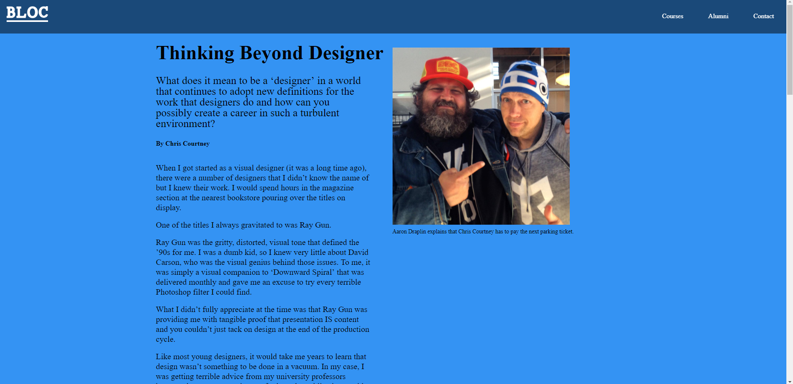

# css-exercise-two
Assignment for CSS Fundamentals in Bloc program

Practiced making websites more readable by applying hierarchy to text, utilizing proper line-height, and displaying contrast in color.
Also ensured images and hyperlinks displayed properly.

